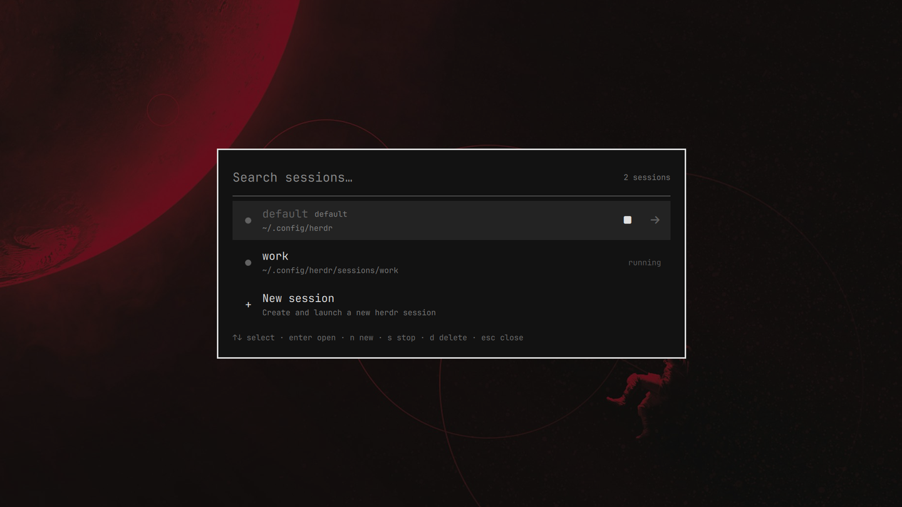

# Herdr Sessions for Omarchy

Interactive session picker, launcher, and manager for [Herdr](https://herdr.dev) AI coding agent sessions.



---

### Step 1: Install

```bash
omarchy plugin add https://github.com/houtvongsak/omarchy-herdr-sessions.git --enable
```

---

### Step 2: Add Shortcut

Run this command in your terminal to bind **`Super + Ctrl + Enter`**:

```bash
cat << 'EOF' >> ~/.config/hypr/bindings.lua

-- Herdr Session Picker
hl.unbind("SUPER + CTRL + RETURN")
o.bind("SUPER + CTRL + RETURN", "Herdr Sessions", "omarchy-shell shell toggle io.github.houtvongsak.herdr-sessions")
EOF
hyprctl reload
```

*(Or edit manually with `nano ~/.config/hypr/bindings.lua` and run `hyprctl reload`).*

---

### Step 3: Use It

Press **`Super + Ctrl + Enter`**:

| Key | Action |
|---|---|
| `↑` / `↓` | Select session |
| `Enter` | Launch / attach to session |
| `n` | Create new session |
| `s` | Stop running session |
| `d` / `Delete` | Delete stopped session |
| `Esc` | Clear filter / Close picker |

---

### Removal

Remove the plugin and restore the original `Super + Ctrl + Enter` (opens default herdr):

```bash
omarchy plugin remove io.github.houtvongsak.herdr-sessions
sed -i '/^-- Herdr Session Picker$/,/herdr-sessions")$/d' ~/.config/hypr/bindings.lua
hyprctl reload
```

### License

MIT
